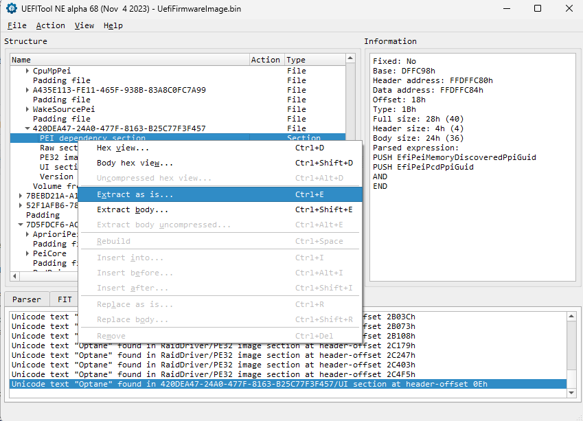

# dpx

```
Parse/patch UEFI module's dependency expressions

Usage: dp [options] <filename>

Arguments:
  filename  The depex file to be processed.

Options:
  -h        Show help information.
  -d        Disassemble the given depex
  -o        File to receive the output
```

## Extracting a dependency expression

1. Download [UEFITool](https://github.com/LongSoft/UEFITool/releases).
2. Drag 'N' Drop UEFI image.
3. On `Action > Search > Text/GUID`, search for your desired module (i.e. "PEI"/"DXE"/"[GUID]")
4. At the bottom, double-click on the search result.
5. Right-click on "XXX dependency section".
6. Choose "Extract as is" or "Extract body...".



## Example of a disassembled dependency expression:

For `Section_DXE_dependency_SetupUtility_SetupUtility.sct` (which was extracted "as is" from [UEFITool](https://github.com/LongSoft/UEFITool/releases)), one gets the following output:

```
[+] Disassembled output:

[i] Header:
---------------------------------
A6 00 00 13

[i] Body:
---------------------------------
PUSH  14afc99e-e23e-11e1-a234-d0df9a35c106
PUSH  d4d2f201-50e8-4d45-8e05-fd49a82a1569
PUSH  EfiVariableArchProtocolGuid                   1e5668e2-8481-11d4-bcf1-0080c73c8881
PUSH  EfiVariableWriteArchProtocolGuid              6441f818-6362-4e44-b570-7dba31dd2453
PUSH  EfiBdsArchProtocolGuid                        665e3ff6-46cc-11d4-9a38-0090273fc14d
PUSH  EfiPcdProtocolGuid                            13a3f0f6-264a-3ef0-f2e0-dec512342f34
PUSH  EfiHiiStringProtocolGuid                      0fd96974-23aa-4cdc-b9cb-98d17750322a
PUSH  EfiHiiDatabaseProtocolGuid                    ef9fc172-a1b2-4693-b327-6d32fc416042
PUSH  EfiHiiConfigRoutingProtocolGuid               587e72d7-cc50-4f79-8209-ca291fc1a10f
AND
AND
AND
AND
AND
AND
AND
AND
END
```

## References:
- https://uefi.org/specs/PI/1.8/V1_PEI_Foundation.html#dependency-expressions
- https://uefi.org/specs/PI/1.8/V1_Dependency_Expression_Grammar.html

*dpx uses SemVer format for versioning
